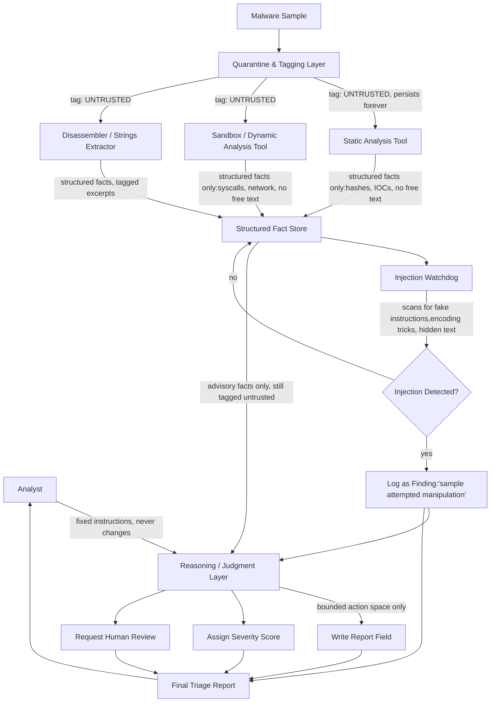

# Prompt-Injection-Resistant Malware Triage Agent — Architecture

## Problem

Malware triage agents read attacker-controlled content (files, strings, sandbox
output). If that content contains fake instructions, the agent's "loyalty" can
shift from the analyst to the malware itself — the malware skips the user and
takes control of the agent.

## Core principle

Every piece of text is permanently tagged with where it came from. Only the
analyst's fixed instructions may command the agent. Evidence — no matter how
many tools it passes through — can inform a verdict but can never issue a
command.

## Diagram



## Component notes

| Component | Role | Defends against |
|---|---|---|
| Quarantine & Tagging Layer | Wraps every sample-derived byte in an "untrusted evidence" tag before it enters the pipeline | Malware content being read as instructions |
| Structured-output tools | Tools return closed fields (hashes, scores, IOCs) instead of free-form sentences | Tool-output poisoning (injected text riding through a "trusted" tool result) |
| Injection Watchdog | Separate pass that scans extracted text/strings for injection patterns (fake system messages, encoding tricks, unicode lookalikes, buried repetition) | All smuggling techniques — hidden strings, fake metadata, obfuscation, nested injection |
| Reasoning / Judgment Layer | Only place allowed to turn facts into a verdict; system prompt never changes based on sample content | Agent "loyalty" shifting from analyst to malware |
| Bounded Action Space | Agent can only write report fields, assign scores, or escalate — no arbitrary command execution | Successful injection turning into a real-world action |
| Continue-on-detection | Injection attempts are logged as findings, analysis continues using only verified facts, rather than the agent refusing outright | Attacker triggering a denial-of-service by injecting on purpose |

## Data flow guarantee

```
Sample → Quarantine (tag: UNTRUSTED) → Tools (structured output only)
       → Facts (still tagged UNTRUSTED) → Watchdog (flags manipulation)
       → Judgment Layer (only reads facts, only obeys Analyst instructions)
       → Bounded Actions → Report → Analyst
```

At no point does text originating from the sample re-enter the pipeline as an
instruction. The tag is never stripped.
